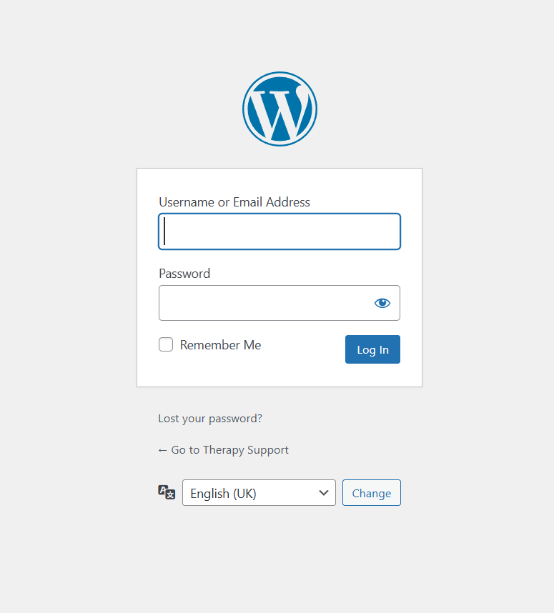
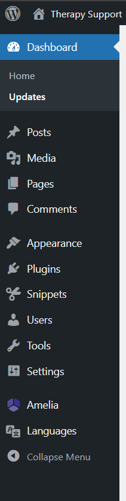
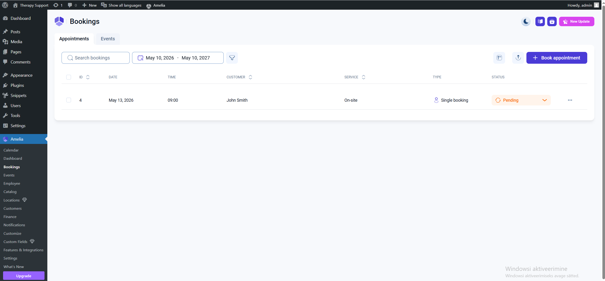
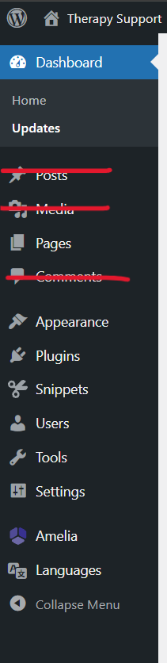
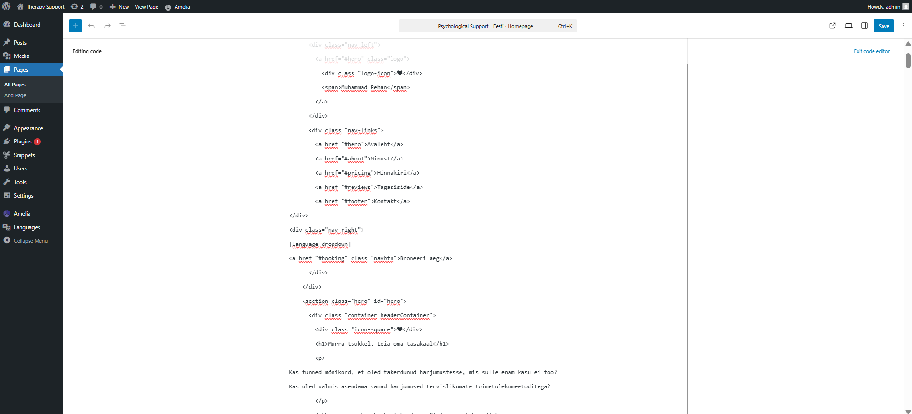
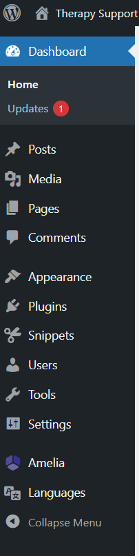

# Booking Site User Guide

**Version:** 1.1  
**Date:** 09.05.2026  
**Site:** WordPress Booking Site (Amelia + Polylang + Code Snippets)

## Table of Contents

- [Booking Site User Guide](#booking-site-user-guide)
  - [Table of Contents](#table-of-contents)
  - [Introduction READ FIRST](#introduction-read-first)
  - [If in thought Google and ask help.](#if-in-thought-google-and-ask-help)
  - [End User Guide](#end-user-guide)
    - [Making a Booking](#making-a-booking)
    - [Switching Language](#switching-language)
  - [WP Admin Guide](#wp-admin-guide)
    - [Accessing the WordPress Admin Panel](#accessing-the-wordpress-admin-panel)
    - [Amelia – Managing Bookings](#amelia--managing-bookings)
    - [Polylang – Managing Translations](#polylang--managing-translations)
    - [Code Snippets – Managing Customizations](#code-snippets--managing-customizations)
    - [Managing Pages and Shortcodes](#managing-pages-and-shortcodes)
    - [Default Page Editor](#default-page-editor)
    - [Updating Plugins](#updating-plugins)
    - [Updating PHP and WordPress Core](#updating-php-and-wordpress-core)
      - [Updating WordPress Core](#updating-wordpress-core)
      - [Updating PHP](#updating-php)
  - [Troubleshooting](#troubleshooting)
    - [Quick Reference Table](#quick-reference-table)
    - [Detailed Troubleshooting Examples](#detailed-troubleshooting-examples)
      - [Example 1: Booking Form Has Disappeared from the Page](#example-1-booking-form-has-disappeared-from-the-page)
      - [Example 2: Site Shows a White Screen After a PHP or Plugin Update](#example-2-site-shows-a-white-screen-after-a-php-or-plugin-update)

---

## Introduction READ FIRST

This guide describes how to use the WordPress-based booking site from two perspectives:

- **End User** – a visitor who wants to make a booking
- **WP Admin** – an administrator who manages bookings, services, and site content

**Technical overview:**

- Booking system: **Amelia** plugin
- Multilingual support: **Polylang**
- JavaScript customizations: **Code Snippets** plugin
- Design: custom HTML + CSS (blank theme file), all styling is hand-built
- Booking form display: shortcodes on pages

This document does not cover all problems and solutions to them.

## If in thought Google and ask help.

## End User Guide

### Making a Booking

1. Open the booking page in your browser.

> ****

2. Select the desired service and time from the booking calendar.

> ****

3. Fill in your details (name, email).

> ****

4. Confirm the booking by clicking **"Book"** (or the equivalent button on the page).

> ****

5. Check your email – a booking confirmation will be sent automatically.

> 💡 If the confirmation email does not arrive within 5 minutes, check your spam folder.

---

### Switching Language

The site supports multiple languages via Polylang.

1. Find the language switcher at the top of the page (flags or abbreviations e.g. ET / EN).
2. Click your preferred language.

> ****

---

## WP Admin Guide

### Accessing the WordPress Admin Panel

1. Open your browser and go to: `https://yoursite.eu/wp-admin`
2. Enter your username and password.
3. Click **"Log In"**.

> ****

> ****

---

### Amelia – Managing Bookings

All bookings are visible in the Amelia dashboard.

1. Log in to the WordPress admin panel.
2. In the left menu, go to **Amelia → Appointments**.

> ****

---

### Polylang – Managing Translations

Polylang allows the site to be displayed in multiple languages.

1. Go to **Languages → Translations**.

2. To translate pages:
   - Go to the **Pages** list
   - The page row has a language icon column – click the pencil icon next to the desired language to add or edit a translation

> ⚠️ Amelia booking form content (service names, descriptions) is translated separately within Amelia settings, not through Polylang.

---

### Code Snippets – Managing Customizations

JavaScript customizations for the site's functionality are added via the Code Snippets plugin.

1. Go to **Snippets → All Snippets**.

2. To edit an existing snippet, click its name.
3. Activate or deactivate a snippet using its toggle switch.

---

### Managing Pages and Shortcodes

The booking form is displayed on a page using a shortcode — a short code like `[amelia ...]` inserted into the page content.

1. Go to **Pages** and open the booking page.
2. In the page content you will see the shortcode, e.g.:

```
[ameliabooking]
```

> ****

---

### Default Page Editor

This site uses custom HTML pages, so the default page editor is not the right tool for changing the page structure or layout.

- The pages are built with custom HTML and shortcodes, not with the block editor.
- Use a code editor to add, modify, or delete page content safely.
- Do not use on the visual editor because it can strip or alter custom HTML and break the booking page layout.

How to work with pages:

1. Open **Pages** and find the page containing the booking shortcode or custom HTML content.
2. Click **Edit** and switch to the **Code Editor** or **Text** view.
3. Add new, modigy or remove HTML content where needed.
   **If HTML language is foreign to you google or ask AI how to use HTML. Since code editor in WordPress is simple it does not show errors. you can only see the errors with dev tools at the webpage.**
4. Modify existing HTML carefully, preserving the shortcode and any custom markup.
5. To remove content, delete the relevant HTML section only, then preview the page before publishing.

> ****

---

### Updating Plugins

Regular updates are important for security and stability.

1. Go to **Dashboard → Updates**.
2. Any available updates will be listed there.
3. **Always back up the site before updating** (via your hosting control panel).
4. Update plugins one at a time and check that the site works correctly after each update.

> ****

> ⚠️ Amelia and Code Snippets updates in particular can affect the booking form – test after updating.

---

### Updating PHP and WordPress Core

Keeping PHP and WordPress core up to date is critical for security. These updates require more caution than plugin updates.

#### Updating WordPress Core

1. Go to **Dashboard → Updates**.
2. If a new WordPress version is available, it will appear at the top of the page under **"An updated version of WordPress is available"**.
3. Before updating:
   - Back up the full site and database via your hosting panel
   - Check that your plugins are compatible with the new WordPress version (check each plugin's page on wordpress.org)
4. Click **"Update Now"**.
5. After the update, navigate through the site and test the booking form end-to-end.

> ⚠️ Never update WordPress core on a live site without a backup. If something breaks, restore from backup and investigate before trying again.

#### Updating PHP

PHP is the server-side language WordPress runs on. PHP updates are done through your **hosting control panel** (e.g. cPanel, Plesk, or your host's custom panel), not from inside WordPress.

**Before updating PHP:**

1. Check what PHP version you are currently running: go to **Tools → Site Health → Info → Server** in WordPress admin.
2. Check PHP compatibility of all active plugins – use the free **PHP Compatibility Checker** plugin or check each plugin's documentation.
3. Back up the full site and database.

**Performing the PHP update (general steps – exact steps vary by host):**

1. Log in to your hosting control panel.
2. Find the **PHP Version Manager** or **PHP Configuration** section.
3. Select the new PHP version (e.g. PHP 8.2 or 8.3).
4. Save the change.
5. Immediately open the site and WordPress admin to check for errors.

> 💡 Recommended PHP versions for WordPress as of 2026: **PHP 8.2** or **8.3**. Avoid versions marked as end-of-life (e.g. PHP 7.4 or 8.0).

**After updating PHP:**

- Check the site frontend and the booking form
- Check WordPress admin for any error notices
- Go to **Tools → Site Health** – it will flag any issues caused by the PHP change
- If a white screen or fatal error appears, revert to the previous PHP version in your hosting panel immediately and investigate which plugin or code is incompatible

> ⚠️ Because this site uses custom CSS, HTML, and Code Snippets with JavaScript, pay extra attention to any errors in the browser console (F12 → Console tab) after a PHP update.

---

## Troubleshooting

### Quick Reference Table

| Problem                                        | Likely Cause                             | Solution                                                          |
| ---------------------------------------------- | ---------------------------------------- | ----------------------------------------------------------------- |
| Booking form not showing on page               | Shortcode deleted or incorrect           | Check the HTML block on the page for the shortcode                |
| Client not receiving confirmation email        | Email settings missing or incorrect      | Check Amelia → Notifications settings                             |
| Calendar showing wrong times                   | Employee working hours not set           | Check Amelia → Employees → Work Hours                             |
| Language not switching                         | Polylang translation missing             | Add the missing translation under Languages → Translations        |
| JavaScript function not working                | Snippet deactivated or has an error      | Check Snippets → All Snippets                                     |
| Site down after plugin update                  | Plugin conflict                          | Deactivate the last updated plugin and contact the developer      |
| White screen after PHP update                  | PHP incompatibility in plugin or snippet | Revert PHP version in hosting panel; check Site Health for errors |
| WordPress admin inaccessible after core update | Corrupted update                         | Restore from backup; re-run update with maintenance mode on       |

---

### Detailed Troubleshooting Examples

---

#### Example 1: Booking Form Has Disappeared from the Page

**Symptom:** The booking form is no longer visible on the booking page. Visitors see a blank area or nothing where the form used to be.

**Step 1 – Check the shortcode**

1. Log in to WordPress admin.
2. Go to **Pages** and open the booking page.
3. Switch the editor to **HTML / Code view** (in the block editor, click the three dots on the block → **Edit as HTML**).
4. Check whether the shortcode (e.g. `[ameliabooking]`) is still present.

If the shortcode is missing, re-add it and save. Test the page in a new private/incognito browser window.

**Step 2 – Check that the Amelia plugin is active**

1. Go to **Plugins → Installed Plugins**.
2. Confirm that **Amelia** shows as **Active** (not deactivated).
3. If it is deactivated, click **Activate** and recheck the page.

**Step 3 – Check for JavaScript errors**

1. Open the booking page in a browser.
2. Press **F12** to open developer tools → go to the **Console** tab.
3. Look for any red error messages. A JS error from a Code Snippet can prevent the form from rendering.
4. If a snippet is causing the issue, go to **Snippets → All Snippets** and temporarily deactivate snippets one by one to identify the culprit.

> 💡 If none of these steps resolve the issue, check the **Amelia → Dashboard** for any licence or connectivity warnings.

---

#### Example 2: Site Shows a White Screen After a PHP or Plugin Update

**Symptom:** After updating PHP (or a plugin), the site shows a completely white/blank page, or a PHP fatal error message.

**Step 1 – Revert the change immediately**

- If you updated **PHP**: log in to your hosting control panel and switch back to the previous PHP version.
- If you updated a **plugin**: log in to WordPress admin. If admin is also white, proceed to Step 2 first.

**Step 2 – Access WordPress admin via safe mode or WP-CLI (if admin is inaccessible)**

Option A – Disable plugins via FTP/File Manager:

1. Open your hosting control panel → **File Manager** (or connect via FTP).
2. Navigate to `wp-content/plugins/`.
3. Rename the folder of the last updated plugin (e.g. `amelia` → `amelia_disabled`).
4. Try opening WordPress admin again.

> 📸 **[ADD SCREENSHOT: hosting file manager showing the plugins folder]**

Option B – Use hosting one-click restore if you have a recent backup.

**Step 3 – Identify the incompatible plugin or snippet**

1. Once in admin, go to **Plugins → Installed Plugins**.
2. Deactivate all plugins except Amelia, Polylang, and Code Snippets.
3. Re-enable PHP update (if that was the cause).
4. Reactivate plugins one by one, testing the site after each.

**Step 4 – Check Code Snippets for PHP errors**

Because this site uses Code Snippets for JavaScript, a snippet may contain PHP that breaks under the new version.

1. Go to **Snippets → All Snippets**.
2. Deactivate all snippets temporarily.
3. Test the site – if it recovers, reactivate snippets one by one to find the problem.

**Step 5 – Check Site Health**

1. Go to **Tools → Site Health**.
2. Review any critical issues flagged there – they often point directly to the incompatibility.

> 💡 After resolving the issue, always document what caused the problem (e.g. "PHP 8.3 incompatible with Code Snippets version X.X") so future updates can account for it.
